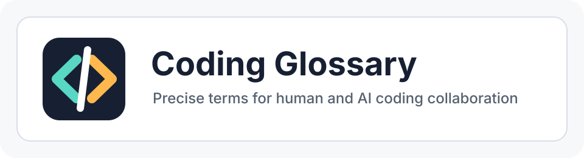

<p align="center">
  
</p>

# Coding Glossary

一个面向人类的大模型编程术语表。

目标是让开发者用更短、更准的工程语言使用大模型：把模糊要求压缩成稳定术语，让模型更快理解任务目标、审查强度、实现风格、架构取舍和验证标准。

来自近 2 年的 Coding 开发实践，适用于修 bug、做代码审查、架构判断、数据建模、测试验证和产品体验打磨。

## 使用方式

把术语直接放进任务描述里：

```text
按最小改动修复这个 bug，严厉审查，不要顺手重构无关模块。
```

```text
这次重点看架构债和依赖倒灌，给我阻断级问题优先。
```

```text
系统性排查，先复现，再定位根因，最后补回归护栏。
```

也可以把多个术语组合成一条更清楚的指令：

```text
最小改动，兼容优先，严厉审查。重点看核心路径、爆炸半径和回归护栏。
```

读这份表时，先看 `推荐组合`，再按具体任务展开对应分组。遇到不确定的词，优先看 `用法`，它最接近真实提示词。

## 术语格式

每个分组都可以展开查看，术语表格包含六列：

|列|说明|
|---|---|
|术语|人类用来快速表达工程意图的短词|
|星级|推荐放进提示词的优先级，综合通用性、识别度和行为改变强度|
|意图倾向|这个词会把模型注意力推向哪些方向，不做合计|
|含义|这个词在人类工程协作里的具体意思|
|模型理解|模型看到这个词后应该触发的行为变化|
|用法|可以直接放进提示词里的写法|

意图倾向使用 `强 / 中 / 弱` 表达，不表示统计占比。多个倾向可以同时为强。

<details>
<summary>代码质量类</summary>

用于让模型关注代码本身是否干净、直接、可维护，而不是只判断功能是否能跑。

|术语|星级|意图倾向|含义|模型理解|用法|
|---|---|---|---|---|---|
|代码洁癖|★★★★☆|审查 强, 重构 中, 实现 中, 验证 弱|对命名、重复、格式、局部坏味道比较敏感，追求代码干净、直接、易读。|不要只满足功能能跑，也要主动指出可读性差、重复、命名含混、局部复杂度过高的问题。|`用代码洁癖标准检查这段实现。`|
|结构洁癖|★★★★★|架构 强, 审查 强, 重构 中, 验证 弱|比代码洁癖更关注模块边界、职责分配、依赖方向和目录组织。|优先判断结构是否清楚，职责是否混乱，是否有跨层调用、公共模块污染、隐式耦合。|`按结构洁癖来改，不要只做表面代码整理。`|
|注释洁癖|★★★★☆|审查 强, 清理 强, 补充 中, 验证 弱|对注释的必要性、真实性和维护成本敏感，反对废话注释、过期注释和误导性注释。|保留解释意图、约束、背景和反直觉决策的注释，删除复述代码行为或已经失真的注释。|`按注释洁癖检查这些注释，该删删，该补补。`|
|可读性优先|★★★★☆|实现 强, 重构 中, 审查 中, 验证 弱|代码应该容易被后来者理解，宁可多几行，也不要过度压缩或炫技。|选择直白、稳定、符合项目习惯的写法，避免晦涩技巧。|`可读性优先，不要为了少几行牺牲清晰度。`|
|最小惊讶原则|★★★★☆|设计 强, 审查 强, 实现 中, 验证 弱|实现方式应该符合读者直觉，不让人读到一半突然发现隐藏行为。|避免隐式副作用、魔法约定、反常命名和不符合上下文习惯的抽象。|`按最小惊讶原则重写这个函数。`|
|坏味道清扫|★★★☆☆|重构 强, 审查 中, 实现 弱, 验证 弱|识别并清理重复代码、长函数、魔法值、临时补丁、混乱分支等局部坏味道。|可以做局部整理，但不要扩大成无关重构。|`修这个问题时顺手做坏味道清扫，但范围控制在当前模块。`|
|技术债显性化|★★★★☆|审查 中, 记录 强, 架构 中, 验证 弱|不一定马上偿还技术债，但要把债务位置、原因、风险和后续处理方式写清楚。|遇到无法当场解决的问题时，不要沉默跳过，要明确记录残余风险。|`如果不能一次修完，做技术债显性化。`|

</details>

<details>
<summary>架构判断类</summary>

用于让模型从模块边界、依赖方向、演进成本和影响范围判断方案是否稳。

|术语|星级|意图倾向|含义|模型理解|用法|
|---|---|---|---|---|---|
|架构债|★★★★★|架构 强, 审查 中, 风险 中, 规划 弱|系统结构层面的长期负担，例如边界不清、依赖混乱、共享状态泛滥、模块职责膨胀。|不要只看单个函数，要从系统演进和维护成本判断问题。|`评估这里有没有架构债，不要只看代码风格。`|
|边界感|★★★★★|架构 强, 审查 强, 实现 中, 验证 弱|模块、层级、服务之间职责清楚，彼此通过稳定接口协作，不越权访问内部细节。|关注 API、目录、数据流和依赖方向是否守住边界。|`重点看这个改动有没有边界感。`|
|依赖倒灌|★★★★★|架构 强, 审查 强, 重构 中, 验证 弱|底层模块反向依赖上层业务，或通用模块被具体业务逻辑污染。|识别依赖方向错误，并建议通过接口、适配层或调用关系调整解决。|`检查有没有依赖倒灌。`|
|抽象过早|★★★★★|架构 强, 审查 强, 删除 中, 验证 弱|还没有稳定重复模式，就提前封装出复杂抽象。|警惕为了“看起来优雅”而增加间接层、配置层、泛型层。|`判断这个封装是不是抽象过早。`|
|抽象不足|★★★★☆|架构 强, 重构 中, 审查 中, 验证 弱|重复逻辑已经稳定出现，但仍然散落在多个地方，没有形成清晰复用点。|建议提炼公共逻辑，但要保持接口简单。|`看看这里是不是抽象不足，重复逻辑是否该收敛。`|
|胶水层|★★★★☆|架构 中, 实现 中, 审查 中, 验证 弱|连接不同模块、服务、协议或第三方库的适配代码。|胶水层应该薄、清楚、可替换，不应该承载核心业务规则。|`这个文件应该只是胶水层，不要塞业务逻辑。`|
|核心路径|★★★★★|风险 强, 验证 强, 架构 中, 实现 中|最影响用户体验、收入、稳定性、性能或数据正确性的调用链。|对核心路径要提高谨慎程度，优先保证稳定、可观测、可回滚。|`这是核心路径，按高风险改动处理。`|
|爆炸半径|★★★★★|风险 强, 审查 中, 规划 中, 验证 弱|一个改动可能影响的模块、用户、数据或运行路径范围。|优先评估影响面，控制改动范围，必要时建议分阶段上线。|`先评估爆炸半径，再决定怎么改。`|
|单一职责|★★★★☆|架构 强, 重构 中, 审查 中, 验证 弱|一个模块、类、函数应该有清楚且单一的变化理由。|发现职责混杂时，建议拆分成更小、更明确的单元。|`按单一职责检查这个模块。`|

</details>

<details>
<summary>数据建模类</summary>

用于让模型识别字段、状态、默认值和真相源背后的业务语义风险。

|术语|星级|意图倾向|含义|模型理解|用法|
|---|---|---|---|---|---|
|假语义字段|★★★★★|建模 强, 审查 强, 澄清 中, 验证 弱|字段名看起来有明确业务含义，但实际数据、约束或使用方式并不支撑这个含义。|警惕字段名和真实语义不一致，追问字段到底代表什么事实。|`检查这里有没有假语义字段。`|
|语义漂移字段|★★★★★|建模 强, 审查 强, 兼容 中, 验证 弱|字段最初有清楚含义，但随着业务演进被不断塞入新含义。|关注历史兼容、旧值解释、新旧逻辑混用和调用方理解偏差。|`看看这个 status 有没有语义漂移字段的问题。`|
|字段含义过载|★★★★★|建模 强, 重构 中, 审查 中, 验证 弱|一个字段承载多个业务维度的信息，导致调用方必须依赖上下文猜测真实含义。|建议拆分字段、引入明确枚举，或把不同维度建模成不同概念。|`重点看有没有字段含义过载。`|
|万能字段|★★★★☆|建模 强, 审查 中, 重构 中, 验证 弱|字段设计过于通用，什么都能放，也什么都说不清，例如 `extra`、`payload`、`data`、`config`。|判断这些字段是否已经承载核心业务逻辑，是否需要结构化建模。|`这个 extra 是不是已经变成万能字段了？`|
|布尔陷阱|★★★★★|建模 强, 审查 强, 重构 中, 验证 弱|用一个布尔字段表达复杂状态，后续不断补判断、补字段或补特殊分支。|如果业务状态不止真假两种，应建议改成状态枚举或明确状态机。|`检查这里有没有布尔陷阱。`|
|标志位地狱|★★★★★|建模 强, 审查 中, 重构 中, 验证 弱|多个 boolean 字段组合表达状态，状态空间膨胀，并且可能互相矛盾。|识别非法组合和状态冲突，建议收敛成单一状态源。|`这些 isPaid、isCanceled、isRefunded 会不会形成标志位地狱？`|
|多真相源|★★★★★|数据一致性 强, 审查 中, 架构 中, 验证 中|同一个业务事实在多个字段、表、缓存或服务中重复保存，但没有明确权威来源。|优先找出谁是 source of truth，并检查同步、一致性和回滚风险。|`检查订单状态有没有多真相源。`|
|默认值谎言|★★★★☆|建模 中, 审查 强, 兼容 中, 验证 中|字段默认值看起来像真实值，但其实只代表没有填写或历史兼容。|区分真实值、缺省值、未知值和未采集值，避免把默认值当事实。|`这里的 score = 0 会不会是默认值谎言？`|
|时间语义混乱|★★★★☆|建模 强, 审查 中, 澄清 强, 验证 弱|时间字段名字相近或语义不清，无法判断到底表示创建、提交、完成、关闭、失效还是同步时间。|要求明确事件主体、时间来源和业务含义，避免用一个时间字段覆盖多个阶段。|`检查这些时间字段有没有时间语义混乱。`|
|字符串枚举黑洞|★★★★★|建模 强, 类型约束 中, 审查 中, 验证 弱|用无约束字符串表达枚举，导致拼写、大小写、历史值和非法值长期混杂。|建议收敛为枚举、常量、类型约束、数据库约束或迁移脚本。|`这个 status 字符串是不是已经变成字符串枚举黑洞了？`|

</details>

<details>
<summary>实现策略类</summary>

用于告诉模型这次改动应该保守、渐进、兼容，还是允许局部重构和删除。

|术语|星级|意图倾向|含义|模型理解|用法|
|---|---|---|---|---|---|
|最小改动|★★★★★|实现 强, 范围控制 强, 验证 中, 审查 弱|只修改完成当前目标必需的部分，避免无关重构、风格漂移和额外行为变化。|优先局部修复，尊重现有模式，不扩大改动面。|`最小改动修复，不要碰无关文件。`|
|顺手重构|★★★★☆|重构 强, 实现 中, 审查 中, 验证 中|在完成主要任务时，只重构当前直接接触且明显阻碍理解或修改的局部。|可以整理，但必须服务当前目标，不能变成大范围重写。|`可以顺手重构，但只限当前函数附近。`|
|防御式实现|★★★★☆|实现 强, 边界条件 强, 验证 中, 审查 弱|主动考虑异常输入、边界条件、失败路径、空值、并发和外部依赖失败。|补充校验、兜底、错误处理和必要的日志。|`防御式实现这个接口。`|
|渐进式改造|★★★★★|规划 强, 兼容 强, 实现 中, 验证 中|不一次性大拆大建，而是分阶段迁移，每一步都保持系统可运行。|设计兼容旧路径的过渡方案，避免一次性高风险替换。|`这块做渐进式改造，不要一口气重写。`|
|兼容优先|★★★★★|兼容 强, 审查 中, 验证 中, 实现 弱|新实现不能破坏既有 API、数据格式、用户习惯或历史行为。|优先检查向后兼容，必要时保留旧接口或提供迁移层。|`这次兼容优先，不能破坏现有调用方。`|
|删除优先|★★★★☆|删除 强, 简化 强, 审查 中, 验证 弱|能通过删除无用代码、废弃分支、重复配置来降低复杂度，就不要新增复杂度。|先寻找可以移除的路径，再考虑新增抽象或补丁。|`删除优先，看看是不是可以少写代码解决。`|
|保守实现|★★★★★|实现 中, 风险 强, 兼容 中, 验证 中|在不确定需求或风险较高时，选择稳定、简单、可回滚的方案。|避免激进重构和新技术引入，优先使用项目已有模式。|`这里保守实现，先保证稳定。`|

</details>

<details>
<summary>审查协作类</summary>

用于控制模型的审查姿态、问题分级、证据要求和协作边界。

|术语|星级|意图倾向|含义|模型理解|用法|
|---|---|---|---|---|---|
|严厉审查|★★★★★|审查 强, 风险 强, 测试 中, 建议 弱|以生产级标准审查代码，优先找 bug、回归风险、安全问题、数据风险和缺失测试。|不要只给鼓励和风格建议，要像代码审查者一样指出阻断级问题。|`严厉审查这个 PR。`|
|审查你的审查结果|★★★★★|复核 强, 审查 强, 证据 强, 校准 中|对模型给出的审查结论再做一次质量检查，确认问题是否真实、分级是否准确、证据是否充分。|删除没证据的结论，修正夸大或轻描淡写的问题，补齐遗漏的阻断级风险。|`审查你的审查结果，去掉没证据的结论。`|
|温和审查|★★★☆☆|审查 中, 对齐 中, 建议 中, 风险 弱|先确认方向和主要实现是否合理，再给出可改进建议。|反馈语气更合作，区分必须修改和可选优化。|`温和审查，主要看有没有明显问题。`|
|阻断级问题|★★★★★|风险 强, 审查 强, 测试 中, 建议 弱|不修就不应该合并的问题，例如数据丢失、安全漏洞、核心流程失败、严重回归。|把这类问题放在最前面，明确为什么必须修。|`只列阻断级问题，其他建议先不要展开。`|
|非阻断建议|★★★★☆|建议 强, 审查 中, 重构 中, 验证 弱|可以提升质量、统一风格或改善可维护性，但不影响当前改动正确性。|标明这是建议，不要和必须修的问题混在一起。|`最后单独列一下非阻断建议。`|
|意图对齐|★★★★☆|澄清 强, 目标 强, 审查 中, 实现 弱|先确认目标、约束和成功标准，再评价实现是否合适。|不要直接陷入细节，先判断代码是否解决了正确的问题。|`先做意图对齐，再给实现建议。`|
|上下文保护|★★★★★|范围控制 强, 审查 中, 实现 中, 验证 弱|尊重已有代码、用户未要求的改动和当前工作区状态，不擅自回滚或扩大范围。|只处理当前任务相关内容，遇到不属于自己的改动要避开。|`注意上下文保护，不要改我没提到的文件。`|

</details>

<details>
<summary>调试定位类</summary>

用于让模型按证据链排查问题，而不是凭直觉直接改代码。

|术语|星级|意图倾向|含义|模型理解|用法|
|---|---|---|---|---|---|
|系统性排查|★★★★★|调试 强, 证据 强, 验证 中, 修复 中|按复现、观察、假设、验证、修复的顺序排查问题。|不要凭直觉直接改代码，要先建立证据链。|`系统性排查这个 bug。`|
|根因修复|★★★★★|调试 强, 修复 强, 验证 中, 解释 弱|修导致问题的真实原因，而不是只修表面症状。|定位到根本错误路径，并说明为什么这个修复能防止复发。|`不要只止血，做根因修复。`|
|症状止血|★★★★☆|修复 强, 风险 强, 规划 中, 验证 弱|先快速降低线上影响，再安排完整根因治理。|短期方案可以保守直接，但要明确后续根治动作。|`先症状止血，之后再补根因修复方案。`|
|最小复现|★★★★★|复现 强, 调试 中, 验证 中, 修复 弱|构造能稳定触发问题的最小场景。|减少变量，证明问题存在，再基于复现修复。|`先给我一个最小复现。`|
|回归护栏|★★★★★|测试 强, 验证 强, 类型约束 中, 监控 中|通过测试、断言、类型约束、监控或校验防止同类问题再次出现。|修复后要补一个能抓住该问题的保护机制。|`修完后补回归护栏。`|

</details>

<details>
<summary>测试验证类</summary>

用于要求模型用测试、日志、截图、命令输出或推理证据支撑结论。

|术语|星级|意图倾向|含义|模型理解|用法|
|---|---|---|---|---|---|
|证据优先|★★★★★|验证 强, 证据 强, 解释 中, 审查 中|不要只说“应该好了”，要给出测试、日志、截图、命令输出或推理证据。|完成前主动验证，并明确哪些验证已做、哪些没做。|`证据优先，最后告诉我你跑了什么验证。`|
|风险定向测试|★★★★★|测试 强, 风险 强, 验证 中, 范围控制 中|测试重点覆盖最可能出错、失败代价最高、最接近本次改动的路径。|不要盲目追求全量测试，先覆盖风险核心。|`做风险定向测试，不用为了形式跑所有东西。`|
|快测优先|★★★★☆|测试 强, 反馈 强, 范围控制 中, 扩展验证 弱|先运行最快、最相关的测试，快速获得反馈。|先跑局部测试、单测、类型检查，再视风险决定是否扩展。|`快测优先，先跑和这次改动相关的测试。`|
|行为不变|★★★★★|验证 强, 兼容 强, 审查 中, 实现 弱|重构或整理时，外部可观察行为必须保持一致。|把行为一致性作为验证重点，避免隐藏改动。|`这是行为不变的重构，不要改变任何输出。`|
|金丝雀验证|★★★★☆|发布 中, 风险 强, 观测 强, 回滚 中|先在小范围或低风险环境验证，再扩大影响面。|给出分阶段发布或观测建议，降低上线风险。|`给一个金丝雀验证方案。`|

</details>

<details>
<summary>产品体验类</summary>

用于让模型从真实工作流、信息层级、误操作风险和空状态判断前端体验。

|术语|星级|意图倾向|含义|模型理解|用法|
|---|---|---|---|---|---|
|工作流优先|★★★★★|产品 强, 交互 强, 信息架构 中, 验证 弱|界面和功能围绕用户真实任务流组织，而不是围绕技术模块堆功能。|先理解用户要完成什么，再安排页面、入口和交互顺序。|`工作流优先设计这个页面。`|
|信息密度|★★★★☆|产品 强, 布局 强, 可读性 中, 验证 中|适合后台、SaaS、CRM、运维等工具型产品的紧凑信息组织能力。|避免营销页式大留白和装饰卡片，重视扫描、比较和批量操作。|`这是工具型界面，提高信息密度。`|
|首屏信号|★★★★☆|产品 强, 信息架构 强, 视觉层级 中, 验证 弱|用户打开页面后，第一屏就能知道这是什么、当前状态是什么、下一步能做什么。|优先安排核心对象、关键状态和主要操作。|`增强首屏信号，不要让用户猜。`|
|空状态设计|★★★★☆|产品 强, 文案 中, 交互 中, 验证 中|没有数据、没有结果、没有权限或首次使用时，也要提供清楚反馈和下一步动作。|补齐空状态文案、操作入口和必要解释。|`补齐空状态设计。`|
|误操作保护|★★★★★|风险 强, 交互 中, 权限 中, 验证 中|危险动作需要确认、撤销、权限校验、延迟执行或清晰反馈。|识别删除、覆盖、批量修改、不可逆操作等风险点。|`这个功能要有误操作保护。`|

</details>

<details>
<summary>推荐组合</summary>

按常见代码任务直接组合术语，适合复制后按项目上下文微调。

|场景|星级|意图倾向|推荐提示词|
|---|---|---|---|
|修 bug|★★★★★|调试 强, 复现 强, 修复 强, 验证 强|`系统性排查，先做最小复现，再根因修复，最后补回归护栏。保持最小改动。`|
|做代码审查|★★★★★|审查 强, 风险 强, 测试 中, 复核 强|`严厉审查，优先列阻断级问题，再列非阻断建议。重点看爆炸半径、兼容性和测试缺口。最后审查你的审查结果。`|
|做架构整理|★★★★★|架构 强, 审查 强, 重构 中, 验证 中|`按结构洁癖检查，重点看架构债、边界感、依赖倒灌、抽象过早和抽象不足。`|
|做数据模型审查|★★★★★|建模 强, 审查 强, 一致性 强, 验证 中|`重点检查数据模型里有没有假语义字段、字段含义过载、多真相源、默认值谎言和字符串枚举黑洞。`|
|做前端工具界面|★★★★☆|产品 强, 交互 强, 信息架构 强, 验证 中|`工作流优先，提高信息密度，强化首屏信号，并补齐空状态设计和误操作保护。`|
|做保守上线|★★★★★|风险 强, 兼容 强, 发布 中, 验证 强|`保守实现，兼容优先，控制爆炸半径，给出金丝雀验证方案。`|

</details>

<details>
<summary>收录标准</summary>

用于判断一个新词是否值得进入这份面向大模型编程协作的术语表。

|类型|标准|
|---|---|
|建议收录|能明显改变模型的执行策略。|
|建议收录|词足够短，适合放进一句提示词。|
|建议收录|含义稳定，不依赖某个具体框架。|
|建议收录|能用于代码、审查、调试、架构或产品实现。|
|建议收录|能区分不同工程价值取向，例如速度、稳定性、可读性、兼容性、体验。|
|不建议收录|只有情绪，没有工程指向的词。|
|不建议收录|太泛的词，例如“优化”“完善”“高级”。|
|不建议收录|只适用于单一公司或单一项目的内部黑话。|
|不建议收录|需要很长解释才能理解的概念。|

</details>
